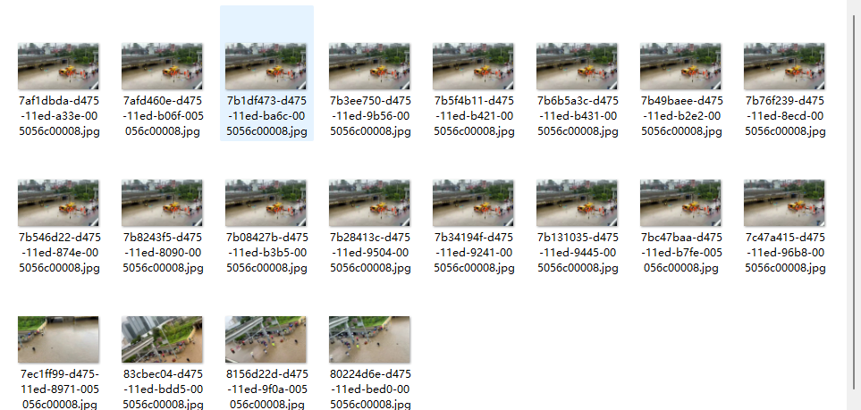
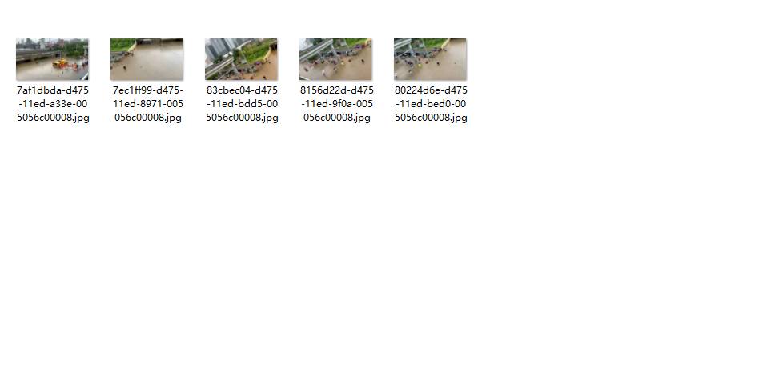

# MIST-SMMD: Media File Data Processing
> The content of this repository contains the implementation source code for media file process in the MIST-SMMD project.

## Video Stabilization Frame to Image
Using the OpenCV library in Python, frames from a video are computed and extracted using the optical flow method to obtain relatively stable frames, which are then saved as JPEG images.
### original Video

### frame extraction

## Highly Similar Image Deletion
Due to the fact that video-to-image conversion is frame-by-frame operation, it may result in a large number of highly similar images. Therefore, we utilize the OpenCV library to perform histogram comparison for these images, setting a threshold of 0.9. When the similarity between images exceeds the threshold, we consider them highly correlated and remove them from the dataset.

### Before Removal

### After removal

